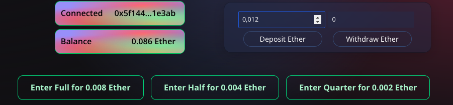
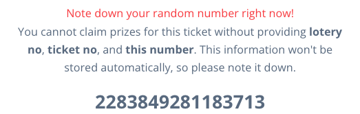
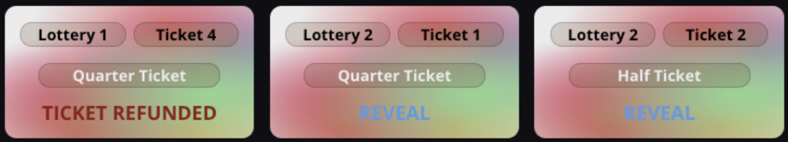
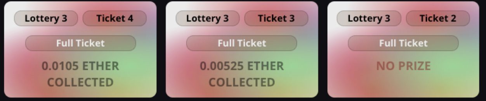

# Commit-Reveal Lottery

## Inspiration: https://ethereum.stackexchange.com/a/207

<br>

The application leverages non-malleable user commitments to eliminate the reliance on on-chain random number generation (RNG). By offloading the RNG process to end users, the application ensures a more secure lottery system. This repository hosts contracts, contract tests, and a React application as an interface.

<br>

## Live Demo at: https://commit-reveal-lottery.surge.sh/

## [Smart Contract](./contracts/contracts/Lottery.sol), [Snowtrace](https://testnet.snowtrace.io/address/0x02422ce78f81db2dEE4eBDf736C2AFa0b59d5406)

<br>

## Interact

1. Switch to Fuji from your MetaMask, and navigate to https://commit-reveal-lottery.surge.sh/ to connect your wallet.
2. You must **deposit ether** to the contract to buy tickets. You may **deposit** and **withdraw** ethers at any amount you like. Your deposit or withdrawal will affect the balance, and then you can buy one of the tickets for the current round.
   
3. When you buy a ticket, **wait for the approval modal to come up**. The application will not let you buy another ticket in this timeframe. The approval modal will give you the <u> random number </u> created.

   For security reasons, the client application will not hold this secret and instead give it to the user. As a participant of a trustless environment, the user is responsible for **revealing** their secret in the next round if they want to check their earnings or claim anything.

   

4. Now wait for the next week :) Rounds take a week, and next week you can check if you won any testnet coins. You can come back and claim your prizes anytime as long as you remember the random number. Clicking on 'reveal' will take you to a modal so that you can pass corresponding random number.

   
   

<br>

## Technical Details

The lottery operates in rounds, each consisting of a purchase phase and a reveal phase. During the purchase phase, which spans a one-week period, users can purchase lottery tickets to participate in the ongoing lottery. To buy a ticket, users must submit a SHA-3 hash of two values: a random number and their address.

The reveal phase follows the purchase phase and lasts for another week. In this phase, participants are required to reveal the random numbers they submitted in the previous phase. Reveal actions must originate from the same address that made the cryptographic commitment, further enhancing security.

1. Purchasing round starts
2. Each user generates their own secret randomn number **locally** and hashes it with their address (msg.sender) using the SHA-3 algorithm. This creates a commitment unique to each user. Users submit these hashes while buying the ticket, and are expected not to lose
3. Once the purchase round ends, the reveal round begins. Reveal round for lottery number N is also the purchase time for the next lottery, N+1. Users are required to submit their random number (N) alongside ticket numbers in this timeframe. The contract verifies that the submitted random number matches the original commitment. If a user fails to reveal a valid random number within the specified time, their ticket is forfeit.

   Contract holds an **XOR accumulator**, which gets XOR'ed with each revealed number, at reveal time on-the-go. This is, not to off-load all the gas cost originating from a big for loop iterating all the revealed numbers. One reveals, they pay immediately.

4. After the reveal round ends, any of the corresponding read methods of the contract will trigger the winner-selection algorithm. This is, as smart contracts cannot invoke themselves. Once lottery time ends, any business-logic function will trigger all the past data to be processed at that point.

   The formula **XOR % numUsers** is used to select the participant who will win the lottery.

<br>

## Prize distribution

There are 3 possible winning positions: 1st, 2nd, and 3rd. There are also 3 ticket types: full, half, and quarter. If a full ticket becomes the 1st, they get 1/2 of all staked money. If the full ticket scores 2nd, they get 1/4. Also if a half ticket scores 1st, they get 1/4. The prize mathematics keep going on like this.

<br>

# Client Application

Is a React application leveraging ethers.js and hardhat. Most critical file is [AppContext.jsx](./client/src/context/AppContext.jsx). It manages all the calls, and provides a singular umbrella to the rest of the application.

Contract is designed to emit specific events at critical points, allowing the client application to easily fetch user history, decreasing dependence on external chain indexing services.

<br>

# Run locally

## Test the contracts

```bash
$ cd contracts && npm i && npm hardhat test
```

See the content of the tests [here](./contracts/test/Lottery.test.js)

## Start local chain

```bash
$ npx hardhat node
```

## Run client application

```bash
$ cd client && npm i && npm run dev
```

<br>

## Average Gas Usage

| Method              | Min   | Max    | Avg    | # Calls |
| ------------------- | ----- | ------ | ------ | ------- |
| buyTicket           | 82661 | 116937 | 84533  | 336     |
| collectTicketRefund | -     | -      | 55933  | 2       |
| revealRndNumber     | 52030 | 118449 | 85397  | 329     |
| collectTicketPrize  | 59224 | 256693 | 133950 | 21      |
| depositEther        | 43955 | 43967  | 43955  | 339     |
| withdrawEther       | -     | -      | 33863  | 2       |
